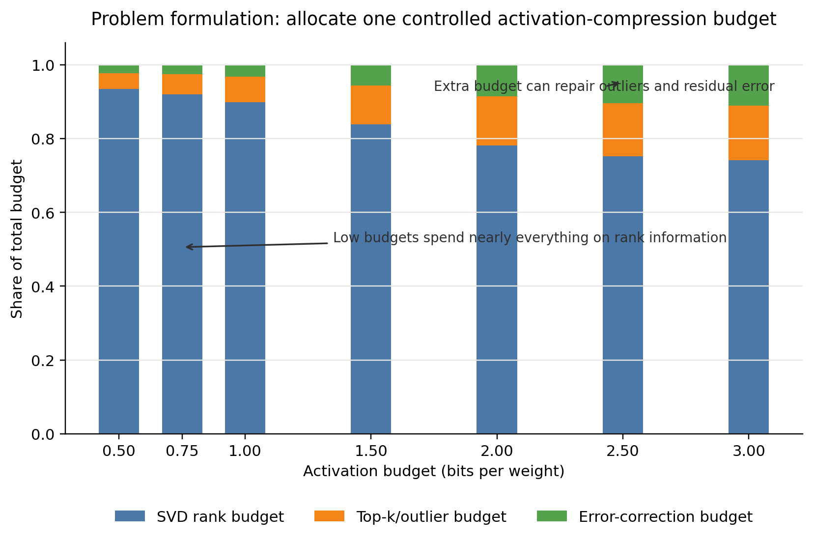
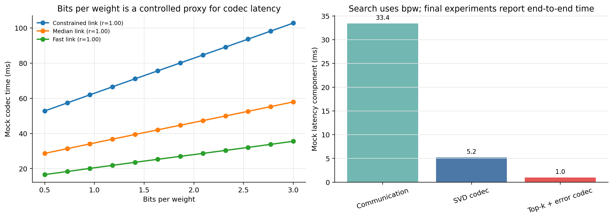
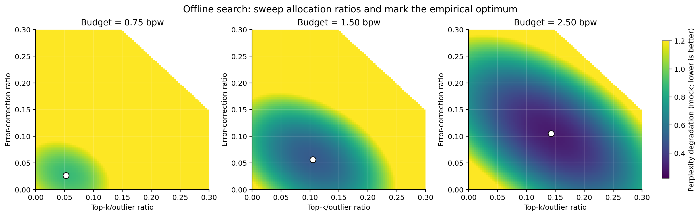
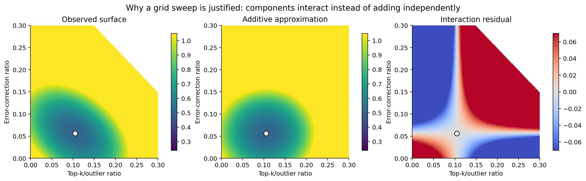
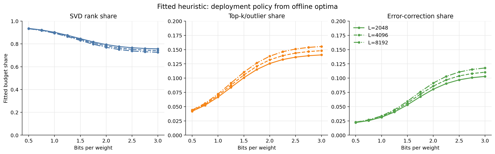
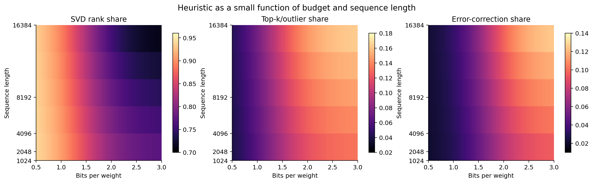

# Optimal Bits Allocation 的呈現方式與實驗設計

這份文件整理 `meeting.txt` 中關於 optimal bits allocation 的提案、討論結論，以及建議在論文中如何把 heuristic policy 講清楚。所有圖都是 mock data 示意圖，用來說明要呈現的圖型和論點，不代表正式實驗結果。

## 1. Double Check：你的整理基本正確

你的三層整理是對的，而且和會議中的主要結論一致：

1. **Problem formulation**：給定 activation compression budget，把 bit 分配到 SVD rank、outlier/top-k preservation、error correction，目標是最小化 perplexity degradation。
2. **Offline search**：在方法開發階段，對每個 bits-per-weight budget 與 sequence length 掃描 allocation ratios，找到 empirical optimum。
3. **Fitted heuristic**：把所有 optimum 擬合成簡單 rule，作為 deployment-time default policy。

需要補強的地方有三個：

1. **Heuristic 的輸入不只 bits per weight，也應該包含 sequence length 或 chunk length。** 會議後半段明確提到 sequence length 會影響 compression behavior，因此 fitted policy 最好寫成 `policy(bits_per_weight, sequence_length)`，而不是只寫成 `policy(bits_per_weight)`。
2. **Offline search 要被定位成作者端方法開發，不是使用者端 calibration。** 這是會議中最重要的轉向：不要讓 reviewer 覺得每個 deploy environment 都要先跑幾百組 calibration。
3. **bits per weight 是 ablation/search 的乾淨 proxy；latency improvement 放在 main experiment report。** 不要把 allocation search 的 x 軸做成 end-to-end codec latency，因為 allocation 本身會同時改變 latency 和 perplexity，問題會變得不乾淨。

修正版一句話可以寫成：

> Optimal bits allocation should be presented as an offline empirical search distilled into an interpolatable heuristic policy conditioned on activation budget and sequence length. The search axis uses bits per weight as a controlled budget proxy, while end-to-end latency gains are reported in the main system experiments.

## 2. 會議中的提案與結論

### 2.1 不要主打 fancy optimizer

會議裡的共識是：文章的核心不要是「我們發明了一個很 fancy 的 allocation optimizer」。比較好的敘事是從 decentralized inference 的 communication bottleneck 出發：

- decentralized inference 的 prefill 階段會傳大量 activation；
- activation communication 是主要 bottleneck；
- 我們提出一個 activation compression codec，並提供一個可控的 budget policy；
- optimal allocation 是為了讓 compression budget 在不同 component 之間合理分配，而不是文章的最大 novelty。

這樣比較不會被 reviewer 拉去攻擊 SVD、top-k 或 error correction 是否本身 novel。



這張圖應該放在 method 或 ablation 前半段，傳達「低 budget 時主要保留 rank information；budget 變大後才逐步分給 top-k/outlier 和 error correction」。

### 2.2 為什麼 search x 軸用 bits per weight

會議中一開始討論過用 end-to-end codec time 當 x 軸，但後來認為不適合。原因是 allocation 會同時影響：

- payload size，也就是 communication time；
- SVD / top-k / error correction 的 compress-decompress overhead；
- perplexity degradation。

如果直接用 codec time 當 x 軸，調整 allocation 時 x 軸和 y 軸會一起變，grid search 的定義會不乾淨。

bits per weight 比較適合做 ablation/search 的 x 軸，因為它是精準、可控制、可跨 network configuration 對齊的 budget proxy。正式 latency 則應該在 main experiment 中報告。



這張圖可以放在 appendix 或 method motivation，用來防守「為什麼不是直接用 latency search」。重點不是宣稱 bits per weight 完全等於 latency，而是它能提供乾淨的 controlled comparison。

### 2.3 Offline empirical search 是必要的

會議中的關鍵論點是：SVD rank、top-k/outlier preservation、error correction 不是互相獨立 additive。它們的效果會互相影響，因此不能只從單一 component 的曲線外推出 optimal allocation。

建議正式實驗要在固定 `bits_per_weight` 和 `sequence_length` 下掃描：

- `topk_ratio`：總 budget 中分給 top-k/outlier 的比例；
- `error_ratio`：總 budget 中分給 error correction 的比例；
- `svd_ratio = 1 - topk_ratio - error_ratio`。

每個 grid point 都用同一份 validation data 測 perplexity degradation，取最低點。



這張 heatmap 是最有說服力的圖之一，因為它直接展示「每個 budget 下都有一個 empirical optimum」。正式圖可以選 2-3 個代表性 budget，例如 `0.75 / 1.5 / 2.5 bpw`。



這張圖用來說明為什麼不能只做 component-wise additive analysis。正式版可以不用一定畫 residual，但至少要有一張 surface/heatmap 能讓 reviewer 看到 top-k 和 error correction 之間有 interaction。

### 2.4 Search 要萃取成 heuristic，而不是交給使用者

會議中最重要的轉向是：不要把 search 描述成 deployment-time calibration。更好的做法是：

1. 作者在方法開發階段做 grid sweep；
2. 對每個 `(bits_per_weight, sequence_length)` 找 empirical optimum；
3. 把 optimum points 擬合成簡單函數或 lookup table；
4. deployment 時使用者只需要給 budget 和 sequence length，policy 直接輸出 allocation。



這張圖是論文中最應該強調的 conclusion figure：它表示我們不是要使用者自己 search，而是已經把 search 結果 distill 成 default rule。



如果空間允許，這張可以放 appendix。它把 heuristic 呈現成 `bits_per_weight x sequence_length -> allocation ratio` 的小函數，補上 sequence length 的維度。

## 3. 建議的 heuristic formalization

令：

- `b` 是 activation budget，單位是 bits per weight；
- `L` 是 sequence length 或 chunk length；
- `a = (r_svd, r_topk, r_err)` 是 allocation ratios；
- `r_svd + r_topk + r_err = 1`；
- `PPLDeg(b, L, a)` 是相對於 uncompressed 或 baseline activation precision 的 perplexity degradation。

Offline search 的定義可以寫成：

```text
a*(b, L) = argmin_a PPLDeg(b, L, a)
subject to r_svd + r_topk + r_err = 1
           r_svd, r_topk, r_err >= 0
           bit accounting is feasible
```

接著用所有 offline optima 擬合 policy：

```text
pi(b, L) -> (r_svd, r_topk, r_err)
```

實作上可以先用最保守、最好解釋的方式：

1. 對 `b` 做 piecewise-linear interpolation；
2. 對 `L` 做 log-space interpolation，例如用 `log2(L)`；
3. 對超出 search range 的值做 clamping；
4. 若 `b >= 3` 且 perplexity 已接近 baseline，可以使用固定 default configuration。

這種 policy 的優點是容易重現、容易寫進論文、也容易在 codebase 中實作。除非實驗顯示曲線很不平滑，不需要一開始就引入複雜 optimizer。

## 4. 正式實驗應該怎麼做

### 4.1 Offline search dataset

Search 用的 validation data 要固定。每個 allocation configuration 都應該在同一批 data 上測 perplexity，否則 optimum 可能只是 data noise。

建議流程：

1. 選一個或多個代表性 language modeling validation subset；
2. 固定 model、chunking、layer split、evaluation script；
3. 對每個 `(b, L)` 跑完整 grid；
4. 記錄 perplexity degradation、actual bits、compress time、decompress time。

perplexity 是 search objective；latency/time 是輔助記錄，用來支持 bits per weight 是合理 proxy。

### 4.2 Search grid

會議中提到的合理範圍：

- `b`: 從 `0.5` 到 `3.0` bits per weight；
- interval: 可以先用 `0.25` 或 `0.5`；
- `L`: 至少 `2048 / 4096 / 8192`；
- `topk_ratio`: 例如 `[0, 0.025, 0.05, ..., 0.25]`；
- `error_ratio`: 例如 `[0, 0.025, 0.05, ..., 0.20]`；
- infeasible points：若 `topk_ratio + error_ratio >= 1` 或 SVD rank bit accounting 不可行，直接跳過。

若實驗成本可接受，先跑密一點；正式圖可以只呈現少數代表點。

### 4.3 Fitting heuristic

先不要把 fitting 做得太 fancy。推薦順序：

1. **Lookup table + interpolation**：最穩、最好 debug。
2. **Monotonic smoothing**：如果 optimum points 有 noise，可以做輕微 smoothing，但要保留原始點。
3. **Closed-form function**：只有當曲線非常規律時才需要。

正式論文可以把 fitted policy 描述成：

> We perform the sweep offline once, then distill the empirical optima into a lightweight interpolation table. At deployment time, the runtime maps a requested activation budget and sequence length to allocation ratios without calibration.

### 4.4 Validation / generalization

要避免 reviewer 質疑 heuristic 只對某個 setting 有效，建議至少做幾個 hold-out：

1. **Hold-out budgets**：例如用 `0.5, 1.0, 1.5, 2.0, 2.5, 3.0` fit，測 `0.75, 1.25, 1.75, 2.25`。
2. **Hold-out sequence lengths**：例如 fit `2048 / 8192`，測 `4096`。
3. **Hold-out models**：用一個模型 fit，另一個模型驗證 regret。
4. **Hold-out partition/world size**：驗證切 2 份、4 份時 optimum allocation 是否接近。

報告方式不要只報 policy 的 perplexity，也要報相對 oracle search 的 regret：

```text
regret(b, L) = PPLDeg(b, L, pi(b, L)) - PPLDeg(b, L, a*(b, L))
```

如果 regret 很小，就能支持「使用者不需要 deployment-time search」這個 claim。

### 4.5 Main system experiment

Search/ablation 用 bits per weight；main experiment 要回到系統目標：

- end-to-end prefill latency；
- communication time；
- compression/decompression overhead；
- perplexity degradation；
- 不同 bandwidth / RTT；
- 不同 context length；
- 不同 model size。

會議中也提到 baseline 應該避免看起來太弱：如果現有系統使用 weight quantization，例如 Q4_K_M，那 baseline 可以寫成「weights already quantized, activations remain bf16/fp16」。我們的方法比較的是 activation communication，而不是 weight compression。

## 5. 論文呈現建議

Method section 可以這樣排：

1. **Decentralized inference bottleneck**：先講 problem，不先講 SVD/top-k 細節。
2. **Activation compression budget**：定義 bits per weight，說明它是 controlled budget proxy。
3. **Codec components**：簡短介紹 SVD rank、top-k/outlier preservation、error correction。
4. **Offline allocation search**：定義 grid search objective。
5. **Heuristic distillation**：把 empirical optima 變成 deployment-time policy。

Ablation section 可以這樣排：

1. heatmap/surface：證明 allocation 有 empirical optimum；
2. interaction：證明三個 component 不是獨立 additive；
3. heuristic regret：證明 fitted policy 接近 oracle search；
4. sensitivity：budget、sequence length、model、world size。

Main experiment section 再報告 latency/perplexity 的系統結果。

## 6. 不建議這樣講

避免這些 framing：

- 「我們提出一個新的 optimal allocation optimizer」；
- 「部署時每個使用者要 search 49 或 539 個 configurations」；
- 「allocation 是 latency-optimal」但 search x 軸卻不是 latency；
- 「SVD/top-k/error correction 每個方法本身是主要 novelty」。

更穩的 framing：

- 我們解的是 decentralized inference 的 activation communication bottleneck；
- bits per weight 是 method/ablation 中乾淨可控的 compression budget；
- offline empirical search 揭示 component interaction；
- fitted heuristic 把 search 結果變成 deployment-time default policy；
- latency improvement 在 main system experiments 中驗證。

## 7. 產圖方式

本文件中的示意圖由以下腳本產生：

```bash
uv venv
uv pip install matplotlib numpy
.venv/bin/python scripts/generate_mock_visuals.py
```

產出的圖檔在 `figures/`：

- `allocation_problem_formulation.png`
- `offline_search_heatmaps.png`
- `interaction_surface_residual.png`
- `fitted_heuristic_policy.png`
- `policy_surface_by_sequence.png`
- `bpw_latency_proxy.png`

