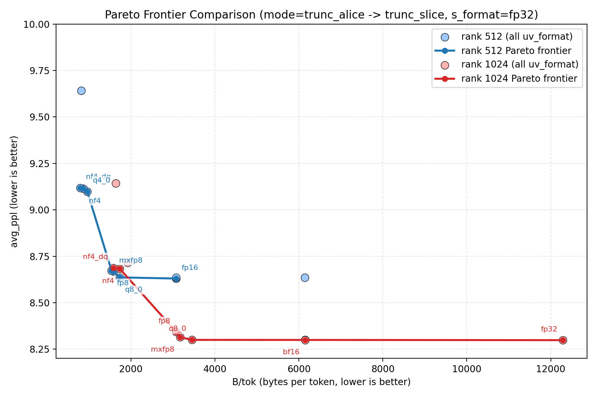
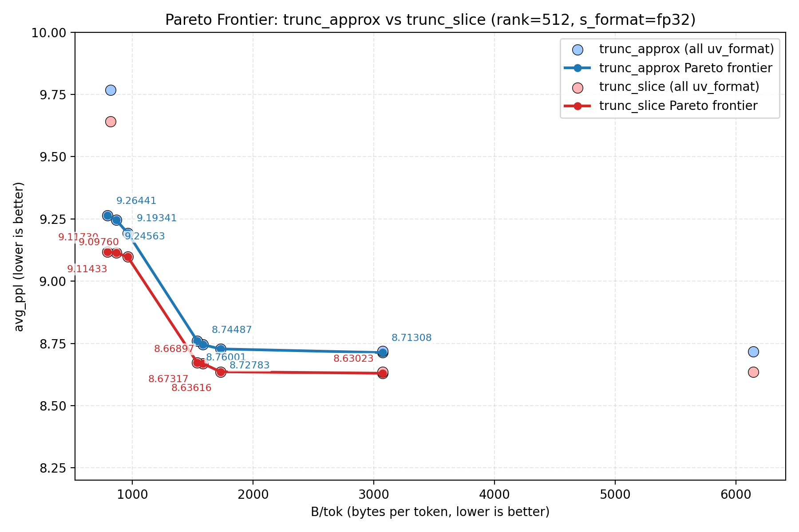
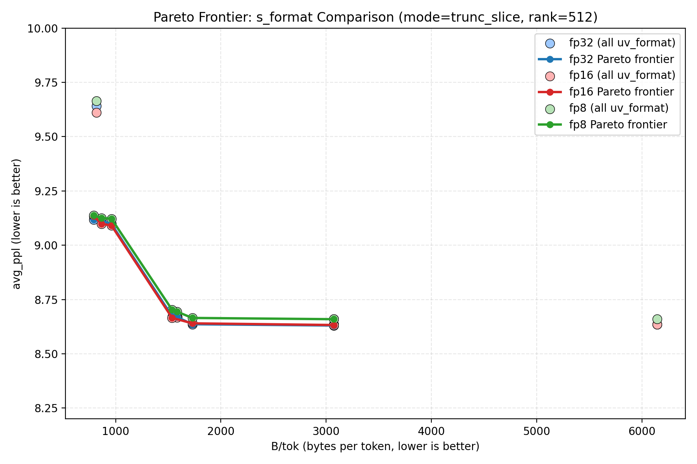

# OnlineSVD + BitSqz PPL Benchmark

## Experiment Setup
- Timestamp: 2026-02-27T16:01:58
- Model name: Qwen/Qwen3-8B
- Model dir: /mnt/ssd/liaw/Qwen/Qwen3-8B
- dtype: bf16
- load_in_8bit: True
- load_in_4bit: False
- max_length: 2048
- stride: 512
- first_k_tokens: 0
- batch_windows: 2
- svd_lowrank niter (`trunc_approx`): 2
- svd_device: auto
- Modes: trunc_slice, trunc_approx
- Ranks: 512, 1024
- U/Vh formats: fp32, fp16, bf16, q8_0, mxfp8, fp8, q4_0, nf4, mxfp4, nf4_dq, q2_k
- S formats: fp32, fp16, fp8
- Combination count: 132
- CSV: `results/onlinesvd_bitsqueeze/onlinesvd_bitsqueeze_ppl_20260226_221024.csv`

## Results
| mode | rank | uv_format | s_format | status | avg_ppl | B/tok | total_bytes | eval_time_s |
|---|---:|---|---|---|---:|---:|---:|---:|
| trunc_approx | 512 | bf16 | fp16 | ok | 8.71012 | 3072.54 | 14649061056 | 270.886 |
| trunc_approx | 512 | bf16 | fp32 | ok | 8.71857 | 3073.02 | 14651389056 | 270.661 |
| trunc_approx | 512 | bf16 | fp8 | ok | 8.7405 | 3072.29 | 14647878432 | 272.962 |
| trunc_approx | 512 | fp16 | fp16 | ok | 8.71841 | 3072.54 | 14649061056 | 273.095 |
| trunc_approx | 512 | fp16 | fp32 | ok | 8.71308 | 3073.02 | 14651389056 | 268.736 |
| trunc_approx | 512 | fp16 | fp8 | ok | 8.75213 | 3072.29 | 14647878432 | 273.235 |
| trunc_approx | 512 | fp32 | fp16 | ok | 8.71203 | 6144.51 | 29295458880 | 265 |
| trunc_approx | 512 | fp32 | fp32 | ok | 8.71737 | 6145 | 29297786880 | 269.806 |
| trunc_approx | 512 | fp32 | fp8 | ok | 8.74253 | 6144.26 | 29294276256 | 270.186 |
| trunc_approx | 512 | fp8 | fp16 | ok | 8.74757 | 1536.54 | 7325824896 | 275.744 |
| trunc_approx | 512 | fp8 | fp32 | ok | 8.76001 | 1537.03 | 7328152896 | 279.029 |
| trunc_approx | 512 | fp8 | fp8 | ok | 8.79252 | 1536.29 | 7324642272 | 279.274 |
| trunc_approx | 512 | mxfp4 | fp16 | ok | 9.80087 | 816.547 | 3893086464 | 277.053 |
| trunc_approx | 512 | mxfp4 | fp32 | ok | 9.76788 | 817.035 | 3895414464 | 279.284 |
| trunc_approx | 512 | mxfp4 | fp8 | ok | 9.84603 | 816.299 | 3891903840 | 278.528 |
| trunc_approx | 512 | mxfp8 | fp16 | ok | 8.74969 | 1584.55 | 7554713856 | 273.713 |
| trunc_approx | 512 | mxfp8 | fp32 | ok | 8.74487 | 1585.04 | 7557041856 | 273.491 |
| trunc_approx | 512 | mxfp8 | fp8 | ok | 8.77006 | 1584.3 | 7553531232 | 275.67 |
| trunc_approx | 512 | nf4 | fp16 | ok | 9.22216 | 864.547 | 4121938176 | 272.838 |
| trunc_approx | 512 | nf4 | fp32 | ok | 9.24563 | 865.035 | 4124266176 | 272.418 |
| trunc_approx | 512 | nf4 | fp8 | ok | 9.26181 | 864.299 | 4120755552 | 273.898 |
| trunc_approx | 512 | nf4_dq | fp16 | ok | 9.26015 | 792.551 | 3778679232 | 276.028 |
| trunc_approx | 512 | nf4_dq | fp32 | ok | 9.26441 | 793.039 | 3781007232 | 277.086 |
| trunc_approx | 512 | nf4_dq | fp8 | ok | 9.2852 | 792.303 | 3777496608 | 277.178 |
| trunc_approx | 512 | q2_k | fp16 | ok | 71.8628 | 504.543 | 2405531712 | 296.459 |
| trunc_approx | 512 | q2_k | fp32 | ok | 72.9632 | 505.031 | 2407859712 | 296.941 |
| trunc_approx | 512 | q2_k | fp8 | ok | 70.8967 | 504.295 | 2404349088 | 295.066 |
| trunc_approx | 512 | q4_0 | fp16 | ok | 9.19281 | 960.547 | 4579641600 | 273.118 |
| trunc_approx | 512 | q4_0 | fp32 | ok | 9.19341 | 961.035 | 4581969600 | 273.316 |
| trunc_approx | 512 | q4_0 | fp8 | ok | 9.24505 | 960.299 | 4578458976 | 273.28 |
| trunc_approx | 512 | q8_0 | fp16 | ok | 8.71813 | 1728.55 | 8241268992 | 272.149 |
| trunc_approx | 512 | q8_0 | fp32 | ok | 8.72783 | 1729.04 | 8243596992 | 270.032 |
| trunc_approx | 512 | q8_0 | fp8 | ok | 8.74545 | 1728.3 | 8240086368 | 270.386 |
| trunc_approx | 1024 | bf16 | fp16 | ok | 8.29683 | 6145.04 | 29297954496 | 398.687 |
| trunc_approx | 1024 | bf16 | fp32 | ok | 8.28667 | 6146.02 | 29302666368 | 404.97 |
| trunc_approx | 1024 | bf16 | fp8 | ok | 8.30626 | 6144.54 | 29295579936 | 462.128 |
| trunc_approx | 1024 | fp16 | fp16 | ok | 8.28936 | 6145.04 | 29297954496 | 470.773 |
| trunc_approx | 1024 | fp16 | fp32 | ok | 8.28859 | 6146.02 | 29302666368 | 403.935 |
| trunc_approx | 1024 | fp16 | fp8 | ok | 8.3092 | 6144.54 | 29295579936 | 471.649 |
| trunc_approx | 1024 | fp32 | fp16 | ok | 8.28402 | 12289 | 58590861888 | 396.392 |
| trunc_approx | 1024 | fp32 | fp32 | ok | 8.28495 | 12290 | 58595573760 | 430.854 |
| trunc_approx | 1024 | fp32 | fp8 | ok | 8.30794 | 12288.5 | 58588487328 | 396.416 |
| trunc_approx | 1024 | fp8 | fp16 | ok | 8.32441 | 3073.04 | 14651463552 | 418.105 |
| trunc_approx | 1024 | fp8 | fp32 | ok | 8.32168 | 3074.03 | 14656175424 | 413.688 |
| trunc_approx | 1024 | fp8 | fp8 | ok | 8.34564 | 3072.54 | 14649088992 | 417.806 |
| trunc_approx | 1024 | mxfp4 | fp16 | ok | 9.11448 | 1633.05 | 7785949440 | 429.324 |
| trunc_approx | 1024 | mxfp4 | fp32 | ok | 9.1383 | 1634.04 | 7790661312 | 416.509 |
| trunc_approx | 1024 | mxfp4 | fp8 | ok | 9.15558 | 1632.55 | 7783574880 | 416.552 |
| trunc_approx | 1024 | mxfp8 | fp16 | ok | 8.30975 | 3169.05 | 15109204224 | 406.263 |
| trunc_approx | 1024 | mxfp8 | fp32 | ok | 8.30648 | 3170.04 | 15113916096 | 436.757 |
| trunc_approx | 1024 | mxfp8 | fp8 | ok | 8.31541 | 3168.55 | 15106829664 | 410.276 |
| trunc_approx | 1024 | nf4 | fp16 | ok | 8.70629 | 1729.05 | 8243652864 | 489.405 |
| trunc_approx | 1024 | nf4 | fp32 | ok | 8.7192 | 1730.04 | 8248364736 | 405.423 |
| trunc_approx | 1024 | nf4 | fp8 | ok | 8.73888 | 1728.55 | 8241278304 | 411.07 |
| trunc_approx | 1024 | nf4_dq | fp16 | ok | 8.7193 | 1585.05 | 7557116352 | 412.723 |
| trunc_approx | 1024 | nf4_dq | fp32 | ok | 8.70187 | 1586.04 | 7561828224 | 410.189 |
| trunc_approx | 1024 | nf4_dq | fp8 | ok | 8.74441 | 1584.55 | 7554741792 | 412.872 |
| trunc_approx | 1024 | q2_k | fp16 | ok | 61.2249 | 1009.04 | 4810858560 | 464.998 |
| trunc_approx | 1024 | q2_k | fp32 | ok | 66.7791 | 1010.03 | 4815570432 | 464.325 |
| trunc_approx | 1024 | q2_k | fp8 | ok | 66.0123 | 1008.54 | 4808484000 | 463.711 |
| trunc_approx | 1024 | q4_0 | fp16 | ok | 8.72114 | 1921.05 | 9159059712 | 469.603 |
| trunc_approx | 1024 | q4_0 | fp32 | ok | 8.70552 | 1922.04 | 9163771584 | 462.554 |
| trunc_approx | 1024 | q4_0 | fp8 | ok | 8.72982 | 1920.55 | 9156685152 | 417.734 |
| trunc_approx | 1024 | q8_0 | fp16 | ok | 8.28863 | 3457.05 | 16482314496 | 465.361 |
| trunc_approx | 1024 | q8_0 | fp32 | ok | 8.29075 | 3458.04 | 16487026368 | 496.078 |
| trunc_approx | 1024 | q8_0 | fp8 | ok | 8.30792 | 3456.55 | 16479939936 | 494.296 |
| trunc_slice | 512 | bf16 | fp16 | ok | 8.63263 | 3072.54 | 14649061056 | 573.977 |
| trunc_slice | 512 | bf16 | fp32 | ok | 8.63486 | 3073.02 | 14651389056 | 572.747 |
| trunc_slice | 512 | bf16 | fp8 | ok | 8.65999 | 3072.29 | 14647878432 | 574.267 |
| trunc_slice | 512 | fp16 | fp16 | ok | 8.63584 | 3072.54 | 14649061056 | 673.139 |
| trunc_slice | 512 | fp16 | fp32 | ok | 8.63023 | 3073.02 | 14651389056 | 568.232 |
| trunc_slice | 512 | fp16 | fp8 | ok | 8.65939 | 3072.29 | 14647878432 | 661.674 |
| trunc_slice | 512 | fp32 | fp16 | ok | 8.6358 | 6144.51 | 29295458880 | 571.807 |
| trunc_slice | 512 | fp32 | fp32 | ok | 8.63476 | 6145 | 29297786880 | 574.907 |
| trunc_slice | 512 | fp32 | fp8 | ok | 8.66032 | 6144.26 | 29294276256 | 570.586 |
| trunc_slice | 512 | fp8 | fp16 | ok | 8.66546 | 1536.54 | 7325824896 | 582.356 |
| trunc_slice | 512 | fp8 | fp32 | ok | 8.67317 | 1537.03 | 7328152896 | 582.279 |
| trunc_slice | 512 | fp8 | fp8 | ok | 8.70291 | 1536.29 | 7324642272 | 583.687 |
| trunc_slice | 512 | mxfp4 | fp16 | ok | 9.6116 | 816.547 | 3893086464 | 578.15 |
| trunc_slice | 512 | mxfp4 | fp32 | ok | 9.64121 | 817.035 | 3895414464 | 581.136 |
| trunc_slice | 512 | mxfp4 | fp8 | ok | 9.66424 | 816.299 | 3891903840 | 580.886 |
| trunc_slice | 512 | mxfp8 | fp16 | ok | 8.66797 | 1584.55 | 7554713856 | 577.54 |
| trunc_slice | 512 | mxfp8 | fp32 | ok | 8.66897 | 1585.04 | 7557041856 | 643.553 |
| trunc_slice | 512 | mxfp8 | fp8 | ok | 8.69391 | 1584.3 | 7553531232 | 573.615 |
| trunc_slice | 512 | nf4 | fp16 | ok | 9.0987 | 864.547 | 4121938176 | 577.217 |
| trunc_slice | 512 | nf4 | fp32 | ok | 9.11433 | 865.035 | 4124266176 | 577.488 |
| trunc_slice | 512 | nf4 | fp8 | ok | 9.12586 | 864.299 | 4120755552 | 579.518 |
| trunc_slice | 512 | nf4_dq | fp16 | ok | 9.13454 | 792.551 | 3778679232 | 578.854 |
| trunc_slice | 512 | nf4_dq | fp32 | ok | 9.1173 | 793.039 | 3781007232 | 580.489 |
| trunc_slice | 512 | nf4_dq | fp8 | ok | 9.13827 | 792.303 | 3777496608 | 575.401 |
| trunc_slice | 512 | q2_k | fp16 | ok | 75.2496 | 504.543 | 2405531712 | 597.857 |
| trunc_slice | 512 | q2_k | fp32 | ok | 76.5645 | 505.031 | 2407859712 | 606.668 |
| trunc_slice | 512 | q2_k | fp8 | ok | 75.127 | 504.295 | 2404349088 | 608.194 |
| trunc_slice | 512 | q4_0 | fp16 | ok | 9.09127 | 960.547 | 4579641600 | 574.194 |
| trunc_slice | 512 | q4_0 | fp32 | ok | 9.0976 | 961.035 | 4581969600 | 573.25 |
| trunc_slice | 512 | q4_0 | fp8 | ok | 9.12215 | 960.299 | 4578458976 | 569.361 |
| trunc_slice | 512 | q8_0 | fp16 | ok | 8.64029 | 1728.55 | 8241268992 | 573.073 |
| trunc_slice | 512 | q8_0 | fp32 | ok | 8.63616 | 1729.04 | 8243596992 | 573.932 |
| trunc_slice | 512 | q8_0 | fp8 | ok | 8.66513 | 1728.3 | 8240086368 | 587.615 |
| trunc_slice | 1024 | bf16 | fp16 | ok | 8.30281 | 6145.04 | 29297954496 | 600.761 |
| trunc_slice | 1024 | bf16 | fp32 | ok | 8.29961 | 6146.02 | 29302666368 | 604.11 |
| trunc_slice | 1024 | bf16 | fp8 | ok | 8.32221 | 6144.54 | 29295579936 | 604.08 |
| trunc_slice | 1024 | fp16 | fp16 | ok | 8.29852 | 6145.04 | 29297954496 | 604.502 |
| trunc_slice | 1024 | fp16 | fp32 | ok | 8.30056 | 6146.02 | 29302666368 | 605.326 |
| trunc_slice | 1024 | fp16 | fp8 | ok | 8.32534 | 6144.54 | 29295579936 | 605.321 |
| trunc_slice | 1024 | fp32 | fp16 | ok | 8.29529 | 12289 | 58590861888 | 592.952 |
| trunc_slice | 1024 | fp32 | fp32 | ok | 8.29841 | 12290 | 58595573760 | 592.484 |
| trunc_slice | 1024 | fp32 | fp8 | ok | 8.3227 | 12288.5 | 58588487328 | 592.886 |
| trunc_slice | 1024 | fp8 | fp16 | ok | 8.32994 | 3073.04 | 14651463552 | 620.248 |
| trunc_slice | 1024 | fp8 | fp32 | ok | 8.34347 | 3074.03 | 14656175424 | 619.665 |
| trunc_slice | 1024 | fp8 | fp8 | ok | 8.35277 | 3072.54 | 14649088992 | 635.9 |
| trunc_slice | 1024 | mxfp4 | fp16 | ok | 9.11319 | 1633.05 | 7785949440 | 661.172 |
| trunc_slice | 1024 | mxfp4 | fp32 | ok | 9.1425 | 1634.04 | 7790661312 | 769.335 |
| trunc_slice | 1024 | mxfp4 | fp8 | ok | 9.15779 | 1632.55 | 7783574880 | 734.537 |
| trunc_slice | 1024 | mxfp8 | fp16 | ok | 8.32237 | 3169.05 | 15109204224 | 609.07 |
| trunc_slice | 1024 | mxfp8 | fp32 | ok | 8.31442 | 3170.04 | 15113916096 | 609.673 |
| trunc_slice | 1024 | mxfp8 | fp8 | ok | 8.32903 | 3168.55 | 15106829664 | 606.1 |
| trunc_slice | 1024 | nf4 | fp16 | ok | 8.69193 | 1729.05 | 8243652864 | 651.722 |
| trunc_slice | 1024 | nf4 | fp32 | ok | 8.68383 | 1730.04 | 8248364736 | 716.26 |
| trunc_slice | 1024 | nf4 | fp8 | ok | 8.73198 | 1728.55 | 8241278304 | 692.077 |
| trunc_slice | 1024 | nf4_dq | fp16 | ok | 8.72033 | 1585.05 | 7557116352 | 611.172 |
| trunc_slice | 1024 | nf4_dq | fp32 | ok | 8.68667 | 1586.04 | 7561828224 | 613.691 |
| trunc_slice | 1024 | nf4_dq | fp8 | ok | 8.72003 | 1584.55 | 7554741792 | 611.346 |
| trunc_slice | 1024 | q2_k | fp16 | ok | 64.7221 | 1009.04 | 4810858560 | 779.557 |
| trunc_slice | 1024 | q2_k | fp32 | ok | 65.1321 | 1010.03 | 4815570432 | 840.693 |
| trunc_slice | 1024 | q2_k | fp8 | ok | 65.6048 | 1008.54 | 4808484000 | 804.865 |
| trunc_slice | 1024 | q4_0 | fp16 | ok | 8.71392 | 1921.05 | 9159059712 | 725.666 |
| trunc_slice | 1024 | q4_0 | fp32 | ok | 8.716 | 1922.04 | 9163771584 | 638.852 |
| trunc_slice | 1024 | q4_0 | fp8 | ok | 8.73224 | 1920.55 | 9156685152 | 724.083 |
| trunc_slice | 1024 | q8_0 | fp16 | ok | 8.30239 | 3457.05 | 16482314496 | 597.996 |
| trunc_slice | 1024 | q8_0 | fp32 | ok | 8.29982 | 3458.04 | 16487026368 | 601.484 |
| trunc_slice | 1024 | q8_0 | fp8 | ok | 8.32077 | 3456.55 | 16479939936 | 600.891 |

## Summary
- Successful combos: 132/132
- Best (lowest) avg_ppl: mode=trunc_approx, rank=1024, uv_format=fp32, s_format=fp16, avg_ppl=8.28402

## Pareto Frontier Comparison (Rank 512 vs Rank 1024)
- Filtered setting: `mode=trunc_alice` (mapped to `trunc_slice` in this CSV), `s_format=fp32`, `status=ok`.
- X-axis: `B/tok` (`bytes_per_token`, lower is better).
- Y-axis: `avg_ppl` (lower is better).
- Analysis filter: keep only `avg_ppl` in `[8.2, 10.0]`; points outside this range are removed before Pareto computation and plotting.
- Each point corresponds to one `uv_format`.
- Pareto-frontier points are annotated with their `uv_format` labels.
- Rank 512 uses light blue bullets with a blue Pareto frontier line.
- Rank 1024 uses light red bullets with a red Pareto frontier line.

## Pareto Frontier Comparison (trunc_approx vs trunc_slice, Rank 512)
- Filtered setting: `rank=512`, `s_format=fp32`, `status=ok`, `mode in {trunc_approx, trunc_slice}`.
- X-axis: `B/tok` (`bytes_per_token`, lower is better).
- Y-axis: `avg_ppl` (lower is better).
- Analysis filter: keep only `avg_ppl` in `[8.2, 10.0]`; points outside this range are removed before Pareto computation and plotting.
- Each point corresponds to one `uv_format`.
- Pareto-frontier points are annotated with their `avg_ppl` values.
- `trunc_approx` uses a blue series (light-blue bullets + blue frontier line).
- `trunc_slice` uses a red series (light-red bullets + red frontier line).

## Pareto Frontier Comparison (s_format: fp32 vs fp16 vs fp8, trunc_slice Rank 512)
- Filtered setting: `mode=trunc_slice`, `rank=512`, `status=ok`, `s_format in {fp32, fp16, fp8}`.
- X-axis: `B/tok` (`bytes_per_token`, lower is better).
- Y-axis: `avg_ppl` (lower is better).
- Analysis filter: keep only `avg_ppl` in `[8.2, 10.0]`; points outside this range are removed before Pareto computation and plotting.
- Each point corresponds to one `uv_format`.
- `fp32` uses a blue series (light-blue bullets + blue frontier line).
- `fp16` uses a red series (light-red bullets + red frontier line).
- `fp8` uses a green series (light-green bullets + green frontier line).

